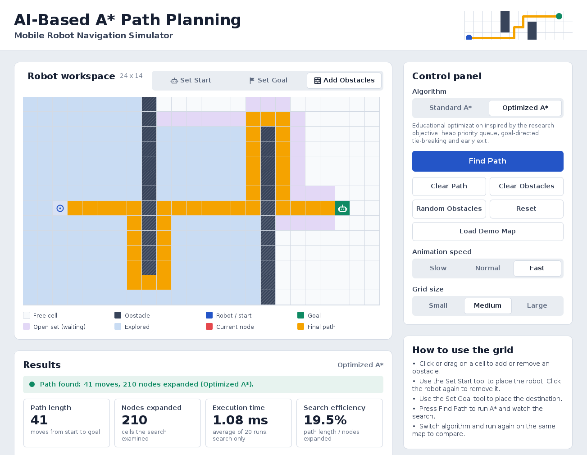
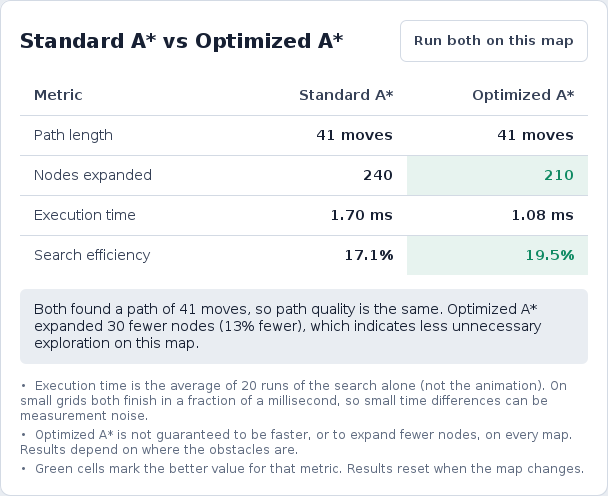
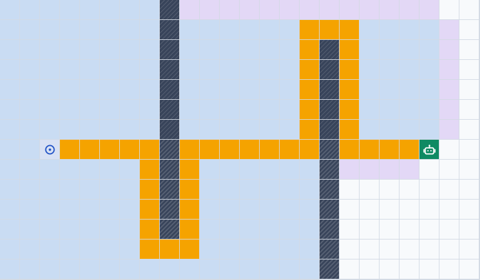
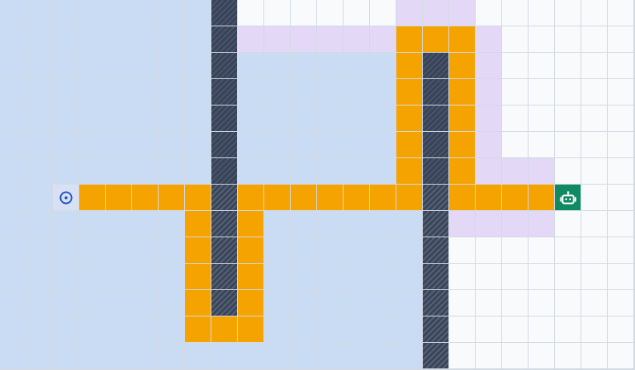
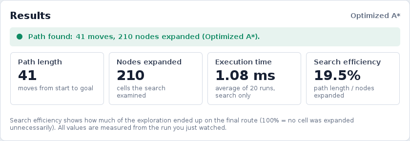
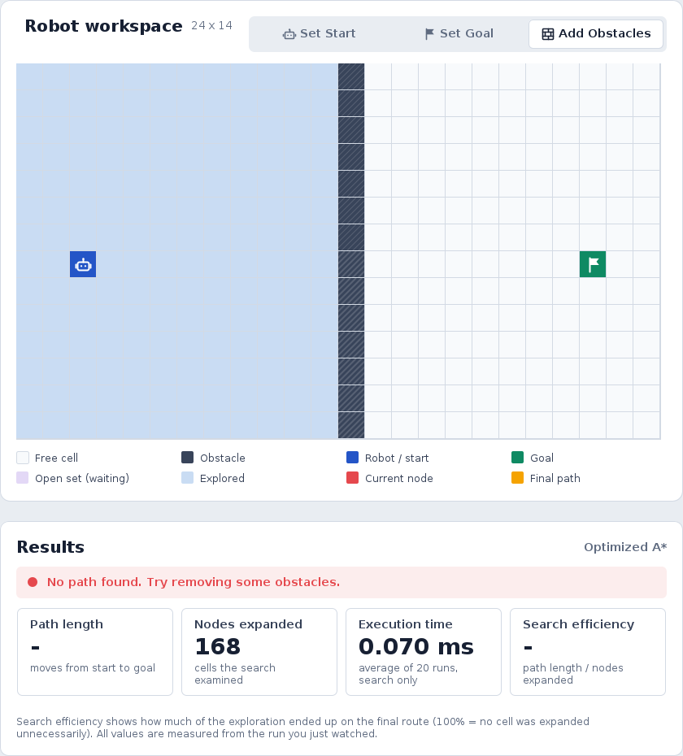

# AI-Based A\* Path Planning and Optimization for Mobile Robots (Java)

A Java desktop application that shows how a mobile robot can find a short and safe route to a goal using the **A\* search algorithm**. The user places obstacles on a grid and presses one button. The app then shows the algorithm searching, and finally the robot moving along the route it found. It can also compare **Standard A\*** with a simple **Optimized A\*** on the same map.

The whole project is written in Java, using only the standard JDK (Swing for the screen). No external libraries are needed.



---

## Student details

| | |
|---|---|
| **Name** | *Vishakha Talele* |
| **Roll number** | *5024163* |

---

## Contents

1. [Overview](#1-overview)
2. [Problem statement and objectives](#2-problem-statement-and-objectives)
3. [The AI technique: A\*](#3-the-ai-technique-a)
4. [How the algorithm works](#4-how-the-algorithm-works)
5. [Standard A\* and Optimized A\*](#5-standard-a-and-optimized-a)
6. [Tech stack](#6-tech-stack)
7. [Features](#7-features)
8. [Architecture](#8-architecture)
9. [How to run the project](#9-how-to-run-the-project)
10. [Demo walkthrough](#10-demo-walkthrough)
11. [Sample output](#11-sample-output)
12. [Real-world use](#12-real-world-use)
13. [Testing](#13-testing)
14. [Limitations](#14-limitations)
15. [Future improvements](#15-future-improvements)
16. [Reference](#16-reference)

---

## 1. Overview

This project was developed for the AI practical (LO 6.1 and 6.2): designing an AI application for a real-world scenario and presenting the solution.

The workspace is a grid. Each cell is either free or blocked by an obstacle. The robot starts in one cell and must reach a goal cell. It can move up, down, left or right, one cell at a time. Diagonal moves are not allowed.

When the user presses **Find Path**, the A\* algorithm runs. The app then replays the search slowly, so the user can see which cells the algorithm examined. After that, the robot moves along the route that was found. No path is hard-coded. Every route shown on the screen is calculated by the algorithm for the map currently on the screen.

**About the research paper.** This project is an educational simulation based on the problem discussed in the paper *"Optimizing the A\* Search Algorithm for Mobile Robotic Devices"*, which is how to make A\* more efficient for robot navigation. It is not a copy of the paper's method. The "Optimized A\*" in this app is a simple optimization made for this project, inspired by the paper's goal of avoiding unnecessary work.

## 2. Problem statement and objectives

**Problem.** A mobile robot must travel from a start point to a goal point without hitting obstacles. Checking every possible route would take too long, and moving without a plan wastes time and battery. The robot needs a fast way to find a short route that avoids obstacles.

**Objectives**

- Show visually how A\* finds a path around obstacles.
- Implement Standard A\* and an Optimized A\* from scratch, without a path-finding library.
- Measure path length, nodes expanded and execution time from real runs, and compare the two versions.
- Explain the AI idea and its real-world use in simple words.

## 3. The AI technique: A\*

A\* (pronounced "A-star") is a search algorithm from the "informed search" family of classical AI. "Informed" means that the algorithm does not search blindly. It uses an estimate of the remaining distance to the goal to decide which cell to explore next.

For every cell **n** that it looks at, A\* calculates:

```
f(n) = g(n) + h(n)
```

| Symbol | Name | Meaning |
|---|---|---|
| **g(n)** | Actual cost | The number of moves taken from the start to cell n |
| **h(n)** | Heuristic (estimated cost) | An estimate of the moves left from cell n to the goal |
| **f(n)** | Estimated total cost | g(n) + h(n), the expected length of a route through n |

**Heuristic used.** The project uses the Manhattan distance, because the robot moves only up, down, left and right:

```
h(n) = |x1 - x2| + |y1 - y2|
```

This is the number of moves needed if there were no obstacles. It never estimates more than the real distance, so A\* is guaranteed to return a shortest path.

**Example.** Suppose the robot reached a cell after 3 moves, and that cell is 5 cells away from the goal by the Manhattan count. Then g = 3, h = 5 and f = 3 + 5 = 8. A\* compares this value with the f values of all other known cells and explores the one with the lowest f.

## 4. How the algorithm works

1. Put the start cell in the **open set** (the list of cells waiting to be explored) with g = 0.
2. Take the cell with the **lowest f** out of the open set.
3. If this cell is the goal, stop. Follow the "parent" links back to the start. This gives the path.
4. Otherwise, look at its four neighbours. Ignore obstacles, cells outside the grid and cells that are already finished.
5. For each neighbour, calculate g, h and f. If the neighbour is already waiting in the open set but the new route to it is shorter, update its cost and its parent.
6. Return to step 2. If the open set becomes empty and the goal was not reached, no path exists.

The cell colours in the app show these steps:

| Colour | Meaning |
|---|---|
| White | Free cell |
| Dark with stripes | Obstacle |
| Blue circle | The cell where the robot started |
| Green flag (or robot on green) | Goal |
| Lavender | Open set: cells the search has seen but not explored yet |
| Light blue | Explored: cells the search has finished with |
| Red | The cell being explored right now |
| Amber (orange-yellow) | The final path |

## 5. Standard A\* and Optimized A\*

Both versions use the same formula, the same Manhattan heuristic and the same moves, so both return a shortest path. They differ in how they manage the open set.

| | Standard A\* (`StandardAStar.java`) | Optimized A\* (`OptimizedAStar.java`) |
|---|---|---|
| Open set | A plain list | A binary min-heap (`MinHeap.java`, a priority queue) |
| Finding the lowest f | Scans the whole list every time | Takes the top item of the heap |
| Two cells with equal f | The cell that has waited longest goes first | The cell with the smaller h (closer to the goal) goes first |
| Duplicate entries | Updates the cost of the cell already in the list | Keeps the best cost for each cell and skips outdated entries |
| When it stops | When the goal is taken out of the open set | As soon as the goal is reached from a neighbour |

**What "optimization" means here.** Doing less unnecessary work (exploring fewer cells) while still returning a path of the same length.

**Important notes**

- This is a simple educational optimization. It is not the method from the research paper.
- It is not guaranteed to be better on every map. On some maps both versions explore the same number of cells. On very small grids the heap can even be slightly slower because of its own overhead. The app shows whatever is measured, and the comparison panel builds its conclusion from the real numbers.

## 6. Tech stack

| Technology | Used for |
|---|---|
| Java 17 or newer | The whole application (developed and tested with JDK 21) |
| Java Swing and Java2D | The user interface, the grid drawing and the icons |
| `javax.swing.Timer` | Playing the search animation step by step |
| Plain `main` test classes | Automated tests (no test library is needed) |

No external library, database or path-finding library is used.

## 7. Features

- Place the robot (start), place the goal, and add or remove obstacles by clicking or dragging.
- Choose between **Standard A\*** and **Optimized A\***.
- Animated search with three speeds (Slow, Normal, Fast) and a Stop button.
- The robot icon moves along the final path.
- Four measured values after every run: **path length, nodes expanded, execution time and search efficiency**, plus a status message.
- A comparison table for the two algorithms, with a conclusion written in plain language.
- Buttons for Clear Path, Clear Obstacles, Random Obstacles, Reset and Load Demo Map.
- Three grid sizes: Small (16 x 10), Medium (24 x 14) and Large (32 x 18).
- Clear messages for problems: no start, no goal, start and goal in the same cell, goal or robot completely blocked, and no possible path. Buttons are locked while a search is running.
- "How A\* Works" and "Real-World Application" sections inside the app.

**How the metrics are measured**

| Metric | Meaning |
|---|---|
| Path length | Number of moves from the start to the goal |
| Nodes expanded | Number of cells the search explored (taken from the open set and their neighbours examined) |
| Execution time | Time taken by the search alone, without the animation. The search is run 20 times and the average is shown, because a single run is too short to time reliably. |
| Search efficiency | `path length / nodes expanded x 100`. It shows how much of the exploration ended up on the final route. 100% means no cell was explored unnecessarily. |

## 8. Architecture

The project is divided into three parts. Each part has one job.

```+--------------------------------------------------------------+
| 1. SCREEN      (astar.ui)                                    |
| Grid, buttons and results (Swing panels)                     |
+--------------------------------------------------------------+
        |                           ^
        | user clicks               | colours, robot position, metrics
        v                           |
+--------------------------------------------------------------+
| 2. CONTROLLER  (astar.controller)                            |
| SimulationController: keeps the app state and                |
| runs the animation                                           |
+--------------------------------------------------------------+
        |                           ^
        | map, start, goal          | path, explored cells, counts
        v                           |
+--------------------------------------------------------------+
| 3. ALGORITHMS  (astar.algorithm)                             |
| Standard A*, Optimized A*, Manhattan distance                |
+--------------------------------------------------------------+
```

**The three parts**

1. **Screen** (`astar.ui`). Draws the grid, buttons and results. It only displays things and reports the user's clicks.
2. **Controller** (`astar.controller.SimulationController`). Stores the state of the app (obstacles, start, goal, selected algorithm), calls the algorithm, and plays the animation.
3. **Algorithms** (`astar.algorithm`). Plain Java code. It receives a map and returns the path and the counts. It contains no screen code.

Keeping them separate means the algorithms can be tested on their own, and the screen can be changed without touching the algorithms.

**What happens when the user presses Find Path**

1. The controller checks the input, for example whether a goal has been placed, and shows a message if something is wrong.
2. It sends the map, start and goal to the chosen algorithm. The algorithm returns the path, the number of nodes expanded and the list of steps it took. The controller also times the search (average of 20 runs).
3. The controller replays the recorded steps one at a time using a Swing timer, and the screen colours the cells.
4. The robot then moves along the path, one cell at a time.
5. When the animation ends, the metrics and the comparison table are updated.

The search is finished before the animation begins. For this reason, the animation speed never affects the measured execution time.

**Folder structure**

```
src/astar/
  Main.java                    Starts the application
  model/                       Small data classes
    Position, Node, SearchStep, AlgorithmResult, Metrics,
    AlgorithmMode, CellVisual, Tool, Speed, GridSize, Status
  algorithm/                   The A* code (no screen code)
    StandardAStar.java         Standard A*
    OptimizedAStar.java        Optimized A*
    MinHeap.java               Priority queue used by Optimized A*
    Heuristic.java, Heuristics.java   Manhattan distance
    PathSearch.java            Interface shared by both algorithms
    NodeUtils.java             Rebuilds the path from the parent links
    AlgorithmRunner.java       Runs a search and measures it
  controller/
    SimulationController.java  App state, editing rules, error messages, animation
  ui/                          Everything that is drawn on the screen
    MainFrame, WorkspacePanel, GridPanel, ControlsPanel, InstructionsPanel,
    ResultsPanel, ComparisonPanel, ExplanationPanel, RealWorldPanel,
    HeaderPanel, FooterPanel
    CardPanel, FlatButton, SegmentedControl, WrapText, Icons, Theme, Format, Ui
                               (small reusable drawing helpers)
  util/
    GridUtils.java             Neighbours, demo and random maps, animation colours
test/astar/
  AlgorithmTests.java          Tests for both algorithms
  ControllerTests.java         Tests for the simulator logic
docs/                          Screenshots used in this README
run.sh, run.bat                Compile and start the app
test.sh, test.bat              Compile and run all tests
```

## 9. How to run the project

**Requirement:** a JDK (Java Development Kit), version 17 or newer, and a computer with a screen. To check, run `java -version` and `javac -version` in a terminal.

**Option 1: run script (easiest)**

- Windows: double-click `run.bat`, or run it in a terminal.
- macOS or Linux: run `./run.sh` in a terminal.

**Option 2: commands**

Run these in the project folder:

```bash
javac -d out -sourcepath src src/astar/Main.java
java -cp out astar.Main
```

**Option 3: an IDE (IntelliJ IDEA, Eclipse, VS Code)**

Open the project folder, mark `src` as the source folder, and run the class `astar.Main`.

**Run the tests**

```bash
./test.sh        # macOS or Linux
test.bat         # Windows
```

## 10. Demo walkthrough

The demonstration takes about 2 to 3 minutes.

1. **Open the app.** Point out the grid, the robot (blue) and the goal (green flag).
2. **Add obstacles.** Make sure "Add Obstacles" is selected, then drag a vertical wall between the robot and the goal, leaving a gap. (Shortcut: press **Load Demo Map**, which builds two walls.)
3. Select **Optimized A\*** and press **Find Path**.
4. **Watch the search.** Lavender cells are waiting, light blue cells have been explored, and the red cell is the one being examined right now.
5. **See the result.** The robot moves along the amber path. Read the four values: path length, nodes expanded, execution time and search efficiency.
6. Select **Standard A\*** and press **Find Path** again on the same map.
7. **Compare.** Look at the comparison table. If the path length is the same and Optimized A\* explored fewer cells, it did less unnecessary work for the same result. (The **Run both on this map** button fills the table instantly.)
8. State clearly that the optimization is a simple educational one and does not always win.
9. Optional: press **Random Obstacles**, or close off the goal completely to show the "No path found" message.

## 11. Sample output

The numbers below come from the app, using the **Run both on this map** button. For a given map, the path length and nodes expanded are the same every time. Execution time changes slightly on every run, so it is not listed in the table.

| Map | Path length (Standard / Optimized) | Nodes expanded (Standard / Optimized) | Efficiency (Standard / Optimized) |
|---|---|---|---|
| Empty map, 24 x 14 | 19 / 19 | 19 / 19 | 100% / 100% |
| Demo map, 24 x 14 | 41 / 41 | 240 / 210 | 17.1% / 19.5% |
| Demo map, 32 x 18 | 57 / 57 | 425 / 361 | 13.4% / 15.8% |

**What the table shows**

- Both algorithms always find a path of the same length, so the path is equally short.
- On the two demo maps, Optimized A\* explored fewer cells: 30 fewer (about 13%) on the 24 x 14 map and 64 fewer (about 15%) on the 32 x 18 map.
- On an empty map, both explore only the cells on the path, so there is nothing to improve.
- Execution time was only about a millisecond or two for both algorithms. At this size, the difference is too small to draw conclusions from.

To repeat this, choose the Medium grid, press **Load Demo Map**, then press **Run both on this map**.

**The comparison table in the app**



**Same map, same path length, different amount of exploration.** Light blue shows what each algorithm explored. Amber is the final path.

| Standard A\* | Optimized A\* |
|---|---|
|  |  |

**The results panel after a run**



**When there is no path.** If the obstacles cut off the goal, the search still explores everything it can reach and then shows "No path found. Try removing some obstacles."



## 12. Real-world use

The same idea works wherever a robot must reach a target while avoiding obstacles. A robot's map can be converted into a grid or a graph, and A\* then finds the route.

- **Warehouse robots.** A robot moves from a storage area to a delivery area while avoiding blocked aisles. This is the example used in the app.
- **Hospital delivery robots.** Carrying medicine or samples through corridors that are often blocked.
- **Factory robots.** Moving parts between machines.
- **Indoor autonomous vehicles.** Car parks, airports and campuses.
- **Hazardous-environment robots.** Reaching a target in an unsafe area while avoiding blocked zones.

## 13. Testing

There are two test classes. They need no test library: run them with `test.sh` or `test.bat`.

**`AlgorithmTests.java` (15 checks).** For each algorithm it checks that:

- a straight path is found on an empty map,
- the path goes around a wall,
- "no path" is reported when the goal is walled off,
- a start that equals the goal is handled,
- on 300 random maps, the path length matches a separate breadth-first search (a simple method known to give the shortest length), and every path is valid: it starts at the start, ends at the goal, moves one cell at a time and never touches an obstacle.

It also checks that the reported metrics come from the real run.

**`ControllerTests.java` (17 checks).** It runs the simulator logic without opening a window and checks that:

- the error messages are correct (no goal, goal on the start cell, goal completely blocked),
- dragging paints obstacles,
- the animation runs and finishes with the correct path and the robot on the goal, for both algorithms,
- Optimized A\* expands fewer nodes than Standard A\* on the demo map,
- editing the map clears old results,
- a full wall gives "No path found",
- the Stop button cancels the animation.

## 14. Limitations

- This is a simulation. There is no real robot, no sensors and no motor control.
- The world is a flat grid where nothing moves. The robot has no size and no turning limits.
- Only four directions of movement are allowed, and every move costs the same. There are no diagonals or different floor types.
- The optimization is simple and is not the method from the paper. It does not always explore fewer cells.
- Execution times on small grids are very short and vary from run to run.

## 15. Future improvements

- Diagonal movement, and a choice of other heuristics such as Euclidean distance.
- Different costs for different floor types.
- Moving obstacles and re-planning while the robot moves (for example D\* Lite).
- Stronger optimizations such as Jump Point Search.
- A step-by-step mode and a live view of the open set.
- Saving and loading maps.

## 16. Reference

**Main paper.** *"Optimizing the A\* Search Algorithm for Mobile Robotic Devices"*
